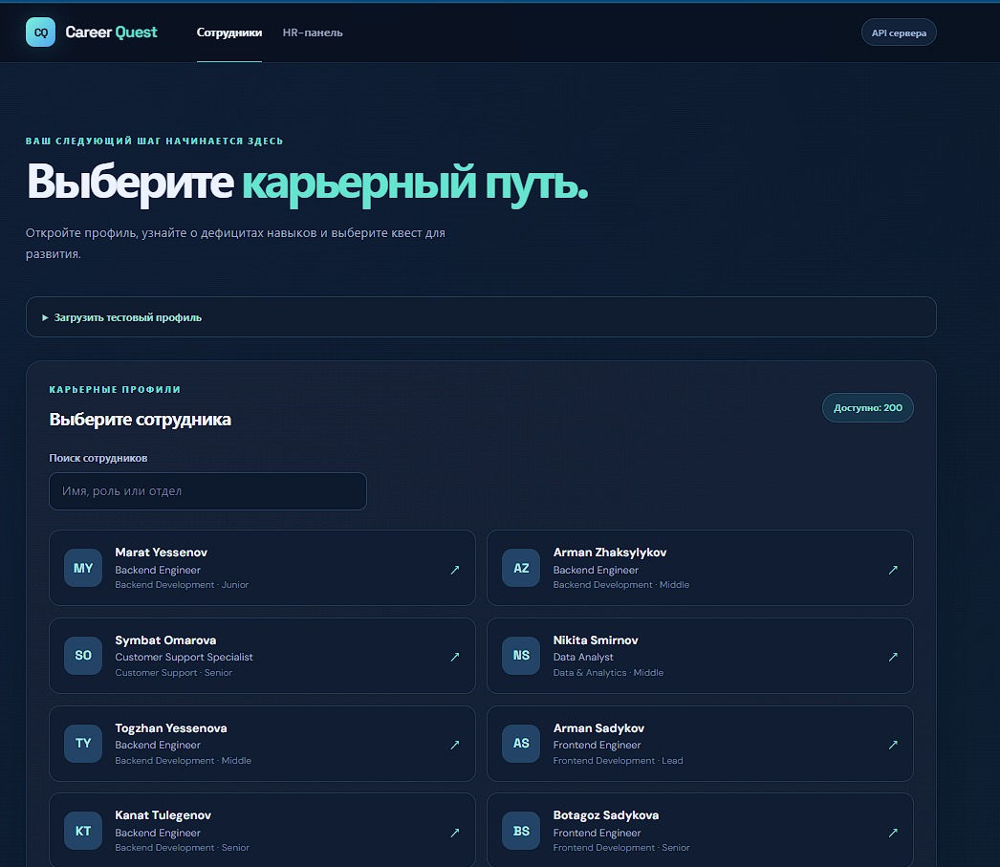
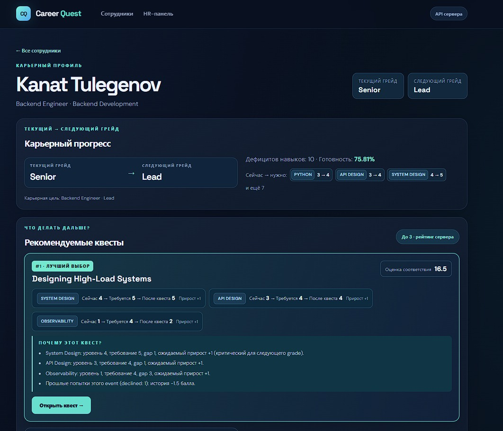
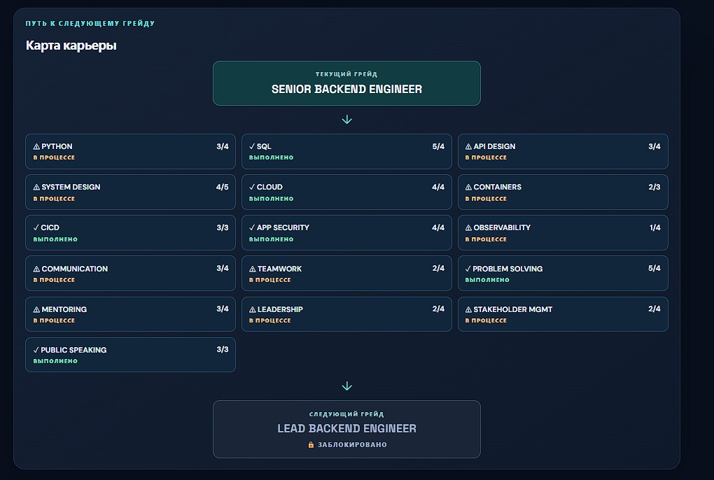
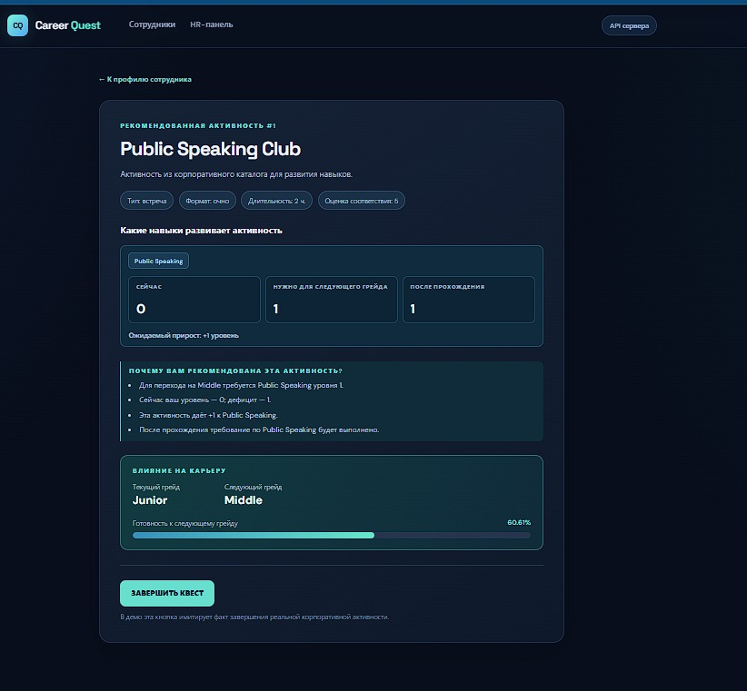
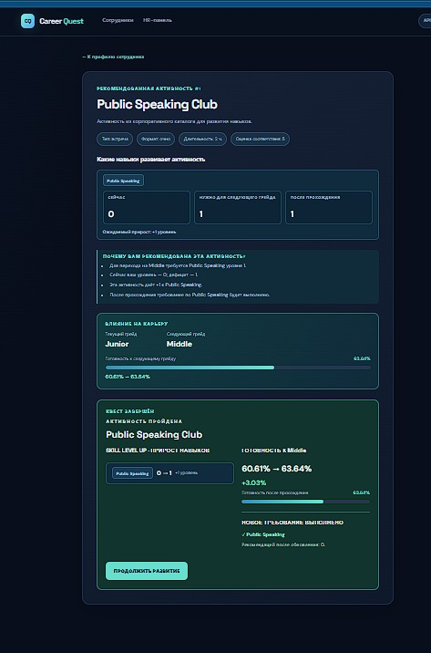

# Career Quest

## 1. Название проекта

**Career Quest — навигатор развития сотрудников.**

Команда **Moisey**, HackAlem AI, трек Halyk Bank, кейс № 1. Репозиторий команды: [BAITC-Hacks/hack-ae82671f-moisey](https://github.com/BAITC-Hacks/hack-ae82671f-moisey).

## 2. Краткое описание

Сотруднику сложно понять, какие из разрозненных обучающих мероприятий приблизят его к следующему карьерному уровню. Career Quest связывает требования грейда, текущие навыки и историю участия: показывает дефициты, предлагает подходящие активности и объясняет выбор. После завершения квеста сотрудник видит изменение навыков, а HR — обновлённые показатели команды.

Основные пользователи — сотрудники и HR-специалисты. Текущая версия представляет собой локальный прототип с русскоязычным интерфейсом, синтетическими данными стартового набора, завершением активностей, импортом проверочного профиля и HR Dashboard. Рекомендации рассчитываются детерминированным алгоритмом: AI/LLM-модель в продукт пока не интегрирована.

**Быстрый переход:** [запуск](#7-установка-и-запуск) · [проверка для жюри](#8-как-проверить-решение) · [ограничения](#10-ограничения).

### Интерфейс Career Quest

<p align="center">
  
</p>

Главный экран Career Quest позволяет выбрать сотрудника и перейти к его персональному карьерному маршруту.

### Основной сценарий работы

<table>
  <tr>
    <td width="50%">
      
      <br>
      <b>Карьерный профиль</b><br>
      Текущий и следующий грейд, готовность и персональные рекомендации.
    </td>
    <td width="50%">
      
      <br>
      <b>Карта карьеры</b><br>
      Выполненные требования и навыки, которые необходимо развить.
    </td>
  </tr>
  <tr>
    <td width="50%">
      
      <br>
      <b>Рекомендованный квест</b><br>
      Целевые навыки, ожидаемый прирост и объяснение рекомендации.
    </td>
    <td width="50%">
      
      <br>
      <b>Результат квеста</b><br>
      Фактический прирост навыков и изменение готовности к следующему грейду.
    </td>
  </tr>
</table>

## 3. Что реализовано

| Функция | Что доступно в текущей версии |
| --- | --- |
| Профили | Выбор из датасета, поиск по имени, роли и отделу; просмотр текущего и следующего грейда |
| Карта карьеры | Интерактивная карта требований текущей роли: выполненные, развиваемые и недостающие навыки |
| Карьерный прогресс | Текущий и следующий грейд, процент готовности, примеры дефицитов и полная таблица требований; карьерная цель показана отдельно |
| Рекомендации | До трёх квестов с выделением первого; оценка соответствия, уровни «сейчас → требуется → после квеста» и все текстовые факторы выбора |
| Завершение квеста | Кнопка «ЗАВЕРШИТЬ КВЕСТ» вызывает backend; интерфейс показывает фактический прирост, готовность до/после и новые выполненные требования |
| HR Dashboard | Дефициты компетенций, сотрудники без рекомендаций с причинами, участие по мероприятиям |
| Фильтры HR | Отдел и грейд для всех показателей, причина отсутствия рекомендации, поиск мероприятия |
| Согласованное состояние | Профиль, рекомендации и HR используют текущие навыки из общего состояния backend |
| Проверка данных | Контроль дубликатов идентификаторов и связей сотрудников, руководителей, мероприятий и навыков |
| Импорт для жюри | Загрузка JSON с одним сотрудником и необязательной историей; проверка полей и связей, открытие нового профиля |
| Сброс демонстрации | `POST /demo/reset` восстанавливает исходные навыки, удаляет новые завершения, импортированные профили и их историю |
| Автотесты | Проверки рекомендаций, завершения квестов, импорта, HR-агрегатов, фильтров и сброса состояния |

Публичного рейтинга сотрудников нет. Обязательные мероприятия исключаются из рекомендаций, но остаются в статистике участия. Валюта, магазин наград и совместные квесты не реализованы.

## 4. Как работает решение

### Сценарий сотрудника и HR

1. При запуске backend читает четыре файла из `data/`. Навыки последней оценки дополняются приростом от завершённых после неё активностей.
2. Сотрудник открывает профиль и видит требования следующего грейда своей текущей роли: `Junior → Middle → Senior → Lead`.
3. Система отбирает доступные мероприятия, которые уменьшают хотя бы один дефицит навыка, и возвращает до трёх рекомендаций с объяснениями.
4. Сотрудник открывает квест, изучает ожидаемый прирост и нажимает «ЗАВЕРШИТЬ КВЕСТ».
5. Backend проверяет доступность, применяет прирост и обновляет состояние. Интерфейс повторно получает карьерный профиль и рекомендации, показывает изменения навыков, процента готовности и вновь выполненные требования.
6. HR открывает `/hr` или нажимает «Обновить данные»: дефициты пересчитываются, новое завершение появляется в статистике мероприятия.
7. Для проверки нового сотрудника жюри раскрывает «Загрузить тестовый профиль» на главной странице, выбирает JSON и открывает импортированный профиль. Его навыки, рекомендации и история включаются в общие расчёты.

### Логика рекомендаций

Из кандидатов исключаются обязательные мероприятия, неподходящие роли и грейды, активности с невыполненными предварительными требованиями, уже начатые и ранее завершённые мероприятия. Исключение для повторного прохождения — `EV_036`. Для мероприятий по расписанию нужна сессия не раньше даты среза; `self_paced` доступен без сессии.

```text
прирост = max(0, min(gain, max_level − текущий уровень))
новый уровень = текущий уровень + прирост
дефицит = max(0, требуемый уровень − текущий уровень)
полезный прирост = min(прирост, дефицит)
```

Ранжирование учитывает несколько факторов:

| Компонент | Расчёт балла |
| --- | --- |
| Величина дефицита | `2 × Σ(дефицит × полезный прирост)` |
| Соответствие следующему грейду | `2 × число улучшаемых дефицитных навыков / число навыков мероприятия` |
| Критические навыки | `3 × Σ(полезный прирост критических навыков)` |
| Ожидаемая польза | `Σ(полезный прирост)` |
| История того же мероприятия | `−min(3, 0.75 × no_show + 1 × dropped + 1.5 × declined)` |

Баллы суммируются. При равенстве сравниваются прирост критических навыков, общий полезный прирост и `event_id`. Веса заданы в коде, модель на данных не обучается. Объяснения формируются из рассчитанных уровней, требований, критичности и истории.

Backend также вычисляет готовность: `100 × Σ min(текущий уровень, требуемый уровень) / Σ требуемых уровней`. Требования считаются выполненными только при отсутствии всех дефицитов. Это индикатор выполнения требований датасета, а не автоматическое присвоение нового грейда. Для сотрудника без следующего грейда готовность равна `null`.

### Как читать HR-показатели

- **Дефициты:** число сотрудников с разрывом и доля среди сотрудников, для которых навык требуется на следующем грейде; средний разрыв считается только среди имеющих дефицит. Lead без следующего грейда не входит в расчёт.
- **Нет рекомендации:** причины разделены на отсутствие следующего грейда, выполненные требования и дефициты без доступных мероприятий. Отсутствие рекомендации не трактуется как низкая вовлечённость.
- **Участие:** уникальные сотрудники и отдельные записи попыток по шести статусам. Доля завершений — завершённые записи / все записи мероприятия, включая отказы. При отсутствии записей процент не вычисляется.

Новые завершения добавляются отдельными попытками в память процесса; исходная история не перезаписывается. HR обновляется при открытии, изменении фильтров и нажатии кнопки обновления.

## 5. Технологии

| Область | Используемые технологии |
| --- | --- |
| Backend | Python, FastAPI, Uvicorn |
| Frontend | TypeScript, React 18, React Router 6, Vite 6, CSS |
| Данные | JSON, CSV, индексы и состояние в памяти Python-процесса |
| Тесты | pytest, unittest |
| Проверка frontend | TypeScript и production-сборка Vite |
| AI-модель в приложении | Не подключена; используются явные правила и формулы |
| Внешние сервисы | Google Fonts для шрифтов интерфейса; внешних API для бизнес-логики нет |

Зависимости: [backend/requirements.txt](backend/requirements.txt), [frontend/package.json](frontend/package.json), [frontend/package-lock.json](frontend/package-lock.json). API-ключи для текущей версии не требуются. Использование Codex при разработке не означает наличие AI-модели внутри работающего продукта.

## 6. Архитектура проекта

```text
Браузер (React)
    → /api через dev-прокси Vite
    → FastAPI
        → DatasetRepository → JSON/CSV
        → RuntimeState → текущие навыки и новые завершения
        → RecommendationEngine → доступность и ранжирование
        → QuestService → завершение и пересчёт
        → HrService → агрегаты команды
```

```text
backend/
  app/
    main.py                  HTTP API и общие экземпляры сервисов
    repository.py            Загрузка и проверка датасета
    runtime_state.py         Состояние в памяти, импорт профиля и сброс
    recommendations.py       Расчёт рекомендаций
    quests.py                Завершение квестов
    hr.py                    HR-аналитика
  tests/
    test_recommendations.py
    test_quests.py
    test_hr.py
    test_import_profile.py
  requirements.txt
frontend/
  src/
    api/                     HTTP-клиент, типы и преобразование ответов
    components/              Карта карьеры, результат квеста, общие компоненты
    pages/                   Сотрудники, профиль, квест, HR Dashboard
  package.json
  package-lock.json
  vite.config.ts
data/
  employees.json
  events.json
  skills.json
  activity_history.csv
README.md
```

| Метод и путь | Назначение |
| --- | --- |
| `GET /health` | Проверка доступности |
| `GET /employees` | Список сотрудников |
| `GET /employees/{employee_id}` | Профиль с текущими навыками |
| `GET /employees/{employee_id}/career` | Требования, дефициты и готовность |
| `GET /employees/{employee_id}/recommendations` | Рекомендации, объяснения и составляющие балла |
| `POST /employees/{employee_id}/activities/{event_id}/complete` | Завершение и результат до/после |
| `GET /hr/overview` | Три HR-блока; необязательные параметры `department` и `grade` |
| `POST /demo/import-profile` | Импорт одного профиля и необязательной истории в память процесса |
| `POST /demo/reset` | Сброс завершений и навыков, удаление импортированных профилей и истории |

Интерактивная документация API после стандартного запуска: <http://127.0.0.1:8000/docs>.

## 7. Установка и запуск

### Требования

- Git и доступ к приватному репозиторию команды.
- Python 3.10+ с `pip` и `venv`; локальные проверки выполнялись на Python 3.13.
- Для воспроизведения сборки используйте Node.js 22.14.0 и поставляемый с ним npm.
- Интернет для первоначальной установки зависимостей. Расчёт рекомендаций выполняется локально; при недоступности Google Fonts используются системные шрифты.

Backend нужно запускать **одним процессом**: состояние не разделяется между несколькими workers. Единого скрипта запуска всей системы сейчас нет; используются два терминала.

### Получение проекта

```powershell
git clone https://github.com/BAITC-Hacks/hack-ae82671f-moisey.git
cd hack-ae82671f-moisey
```

Если проект уже клонирован, откройте его корневую папку. При ошибке доступа к GitHub сначала настройте авторизацию аккаунта, которому предоставлен доступ к репозиторию.

### Windows PowerShell — терминал 1

```powershell
python -m venv .venv
.\.venv\Scripts\python.exe -m pip install -r backend\requirements.txt
.\.venv\Scripts\python.exe -m uvicorn backend.app.main:app --host 127.0.0.1 --port 8000
```

Активация виртуального окружения не требуется: команды используют его интерпретатор напрямую. Версии backend-зависимостей заданы диапазонами, поэтому при новой установке могут отличаться от использованных в проверке.

### Windows PowerShell — терминал 2

Из корня проекта:

```powershell
cd frontend
npm.cmd ci
$env:VITE_BACKEND_URL = "http://127.0.0.1:8000"
npm.cmd run dev -- --host 127.0.0.1 --port 5173 --strictPort
```

Откройте [интерфейс сотрудника](http://127.0.0.1:5173/) или [HR Dashboard](http://127.0.0.1:5173/hr). Порты 8000 и 5173 должны быть свободны. Остановка сервера — `Ctrl+C` в соответствующем терминале.

### Linux / macOS

Терминал 1, из корня проекта:

```bash
python3 -m venv .venv
.venv/bin/python -m pip install -r backend/requirements.txt
.venv/bin/python -m uvicorn backend.app.main:app --host 127.0.0.1 --port 8000
```

Терминал 2, из корня проекта:

```bash
cd frontend
npm ci
VITE_BACKEND_URL=http://127.0.0.1:8000 npm run dev -- --host 127.0.0.1 --port 5173 --strictPort
```

### Настройки

| Переменная | Назначение |
| --- | --- |
| `CAREER_QUEST_DATA_DIR` | Каталог с четырьмя файлами датасета; по умолчанию `data/` в корне проекта |
| `VITE_BACKEND_URL` | Адрес backend для dev-прокси; в конфигурации по умолчанию `http://localhost:8000` |
| `VITE_API_URL` | Базовый URL запросов браузера; по умолчанию `/api` |

Для стандартного запуска `.env` не нужен. Образец настроек находится в [frontend/.env.example](frontend/.env.example). Прокси Vite снимает префикс `/api` и направляет запросы в FastAPI. Если задать браузеру прямой адрес API другого origin, потребуется настройка CORS, которой в backend сейчас нет.

Отдельного mock-режима frontend нет. В клиентских переменных `VITE_*` нельзя хранить секреты.

## 8. Как проверить решение

### Демонстрация полного сценария

Все ожидаемые значения ниже относятся к исходному датасету без импортированных профилей и новых завершений. Сначала выполните сценарий сотрудника и HR, затем проверку импорта.

1. Запустите обе части приложения. Для повторной демонстрации сбросьте состояние через `POST /demo/reset` в Swagger UI или командой ниже. Сброс действует на всех сотрудников текущего процесса и удаляет импортированные профили с историей.
2. Откройте `/employee/E0001`. Должны отображаться `Junior → Middle`, карта карьеры, требования навыков и рекомендации. Первое мероприятие для исходного состояния — `EV_005`.
3. Откройте `EV_005` кнопкой «Открыть квест». Проверьте ожидаемый прирост и список факторов выбора.
4. Нажмите «ЗАВЕРШИТЬ КВЕСТ». После обновления данных System Design меняется с **1 на 2**, API Design — с **2 на 3**. Эти требования становятся выполненными, процент готовности увеличивается. Нажмите «Продолжить развитие»: карта и рекомендации в профиле должны обновиться.
5. Откройте `/hr` или нажмите «Обновить данные». Число записей участия меняется с **2 743 на 2 744**; в строке `EV_005` появляется новое завершение, суммарные дефициты этих двух навыков уменьшаются.
6. Выберите отдел и грейд в HR: все три блока должны отражать эту выборку. Проверьте фильтр причин и поиск мероприятия по `EV_005`.
7. Выполните сброс и обновите страницы: исходные показатели должны восстановиться.

В исходном HR-срезе: **200 сотрудников**, **40 мероприятий**, **60 навыков с дефицитами**, **42 сотрудника без рекомендаций**, из которых **26** имеют дефициты без доступных активностей. Это показатели синтетического датасета, а не измеренный эффект внедрения.

### Проверка API через PowerShell

```powershell
# Проверка доступности и восстановление исходного состояния
Invoke-RestMethod http://127.0.0.1:8000/health
Invoke-RestMethod -Method Post http://127.0.0.1:8000/demo/reset

# Профиль, объяснения и составляющие балла
Invoke-RestMethod http://127.0.0.1:8000/employees/E0001/career | ConvertTo-Json -Depth 10
Invoke-RestMethod http://127.0.0.1:8000/employees/E0001/recommendations | ConvertTo-Json -Depth 10

# Завершение: используйте вместо шага с кнопкой, а не повторно после него
Invoke-RestMethod -Method Post http://127.0.0.1:8000/employees/E0001/activities/EV_005/complete | ConvertTo-Json -Depth 10

# Проверка обновлённых HR-показателей
(Invoke-RestMethod http://127.0.0.1:8000/hr/overview).summary | ConvertTo-Json -Depth 5
```

`/health` возвращает `{"status":"ok"}`. Повторный импорт существующего `employee_id` и повторное завершение неповторяемого `EV_005` возвращают HTTP 409; неизвестный сотрудник — HTTP 404; неизвестный фильтр грейда в HR — HTTP 422. У `E0006` нет следующего грейда, а у `E0041` в исходном состоянии есть дефициты, но нет подходящих рекомендаций.

### Автотесты и сборка

Из корня проекта в PowerShell:

```powershell
.\.venv\Scripts\python.exe -m pytest backend\tests -q
```

Из папки `frontend`:

```powershell
npm.cmd run build
```

На Linux/macOS используются `.venv/bin/python` и `npm`. Тесты проверяют ранжирование, фильтры доступности, рост навыков, защиту от повторного начисления, согласованность HR-агрегатов с данными и сброс. Сборка проверяет TypeScript и создаёт `frontend/dist/`.

Проверка относится к коду коммита `67f0413`. На Python 3.13 прошли **45 тестов и 10 subtests**; production-сборка frontend на Node.js 22.14.0 завершилась успешно. Браузерный сценарий обновлённого интерфейса в рамках этой правки документации не прогонялся; команды выше позволяют жюри воспроизвести проверку самостоятельно.

## 9. Данные и интеграции

Используется синтетический стартовый датасет Career Quest версии `1.0`. Дата среза — **2026-10-01**, период истории — **2024-10-01–2026-09-30**. Для расчёта рекомендаций используется дата среза, а не дата компьютера.

| Файл | Содержание |
| --- | --- |
| `data/employees.json` | 200 профилей: роль, грейд, навыки, дата оценки, руководитель, карьерная цель и другие поля |
| `data/events.json` | 40 мероприятий: аудитория, формат, предварительные требования, сессии, прирост навыков `gain` и предел `max_level` |
| `data/skills.json` | 60 навыков, шкала уровней, 32 профиля требований — 8 ролей × 4 грейда |
| `data/activity_history.csv` | 2 743 записи участия со статусами `completed`, `in_progress`, `no_show`, `declined`, `dropped`, `overdue` |

Отсутствующий у сотрудника навык считается равным 0. Исходные JSON/CSV не изменяются при использовании приложения. История и новые завершения учитываются в расчётах, но новые записи не сохраняются на диск.

### Импорт проверочного профиля через интерфейс

На главной странице `/` раскройте «Загрузить тестовый профиль», выберите JSON-файл и нажмите «Загрузить профиль». После успешной загрузки список обновится; ссылка с новым ID откроет профиль сотрудника. Импорт работает через `POST /demo/import-profile`, без перезапуска сервера.

Допустимы два формата:

1. Один JSON-объект сотрудника из массива `employees` исходного файла.
2. Объект `{"employee": {...}, "history": [...]}`. Каждый элемент истории содержит все столбцы `activity_history.csv`; отдельный CSV-файл форма не принимает.

Обязательные поля сотрудника: `employee_id`, `full_name`, `department`, `role`, `grade`, `last_review_date`, `skills`. Роль и грейд должны существовать в каталоге, навыки — иметь известные ID и целочисленные уровни 0–5. Если указан руководитель или карьерная цель, они должны ссылаться на существующие записи. ID сотрудника должен быть новым; замена существующего профиля не поддерживается.

Для каждой записи истории обязательны `record_id`, `employee_id`, `event_id`, `date`, `due_date`, `status`, `completion_pct`, `score`, `feedback_rating`, `assigned_by`. ID записей должны быть уникальными; `employee_id` — совпадать с импортируемым сотрудником, `event_id` — существовать в каталоге. Даты передаются строками `YYYY-MM-DD`; необязательные значения `due_date`, `score`, `feedback_rating` могут быть пустыми строками или `null`.

Чтобы подготовить воспроизводимый пример из поставляемого датасета, выполните из корня проекта в PowerShell:

```powershell
$source = Get-Content data/employees.json -Raw -Encoding UTF8 | ConvertFrom-Json
$profile = $source.employees | Where-Object { $_.employee_id -eq 'E0001' }
$profile.employee_id = 'JURY_001'
$profile.full_name = 'Jury Test Employee'
$history = @(Import-Csv data/activity_history.csv | Where-Object { $_.employee_id -eq 'E0001' })
foreach ($record in $history) {
    $record.employee_id = 'JURY_001'
    $record.record_id = 'JURY_' + $record.record_id
}
$json = @{ employee = $profile; history = $history } | ConvertTo-Json -Depth 10
$examplePath = Join-Path ([IO.Path]::GetTempPath()) 'career-quest-jury-profile.json'
[IO.File]::WriteAllText($examplePath, $json, [Text.UTF8Encoding]::new($false))
Write-Output $examplePath
```

Выберите созданный файл в форме. После импорта исходная выборка увеличится с 200 до 201 сотрудника, новый профиль будет доступен по `/employee/JURY_001`. Его история также войдёт в HR-агрегаты. Повторный импорт того же ID вернёт 409. После `POST /demo/reset` число сотрудников вернётся к 200, а импортированный профиль исчезнет. Команды создают отдельный временный JSON и не изменяют исходный датасет.

### Подмена полного датасета

Для другого каталога навыков, мероприятий или полного набора сотрудников подготовьте четыре файла с исходной схемой и задайте путь перед запуском backend:

```powershell
$env:CAREER_QUEST_DATA_DIR = "D:\datasets\career-quest-test"
.\.venv\Scripts\python.exe -m uvicorn backend.app.main:app --host 127.0.0.1 --port 8000
```

Для возврата к встроенным данным остановите backend, выполните `Remove-Item Env:CAREER_QUEST_DATA_DIR` и запустите сервер снова. Полный каталог читается при старте; веб-импорт добавляет только одного сотрудника с историей и не заменяет справочники.

База данных, корпоративные HR-системы, календарь, мессенджеры и LLM API не подключены. Google Fonts используется для оформления; код приложения не передаёт туда профили сотрудников. Данные стартового набора предназначены для работы в рамках хакатона; не используйте их для публичного распространения или реальные персональные данные для демонстрации.

## 10. Ограничения

Текущая версия закрывает часть требований кейса; ниже перечислены оставшиеся ограничения, которые нужно учитывать при оценке.

- **AI-слой не реализован.** Рекомендации многофакторные и объяснимые, но рассчитываются правилами, а не AI/LLM-моделью.
- **Нет авторизации и разделения прав сотрудник/HR.** Все загруженные профили и HR-экран доступны пользователю локального приложения. Не использовать реальные персональные данные и не публиковать сервис как защищённую корпоративную систему.
- **Нет долговременного хранения.** Перезапуск backend или `POST /demo/reset` удаляет новые завершения и импортированные профили с историей. Несколько процессов backend имеют независимое состояние.
- **Импорт ограничен одним новым сотрудником за запрос.** История передаётся внутри JSON; отдельный CSV, пакет профилей и изменение существующего сотрудника через форму не поддерживаются. Проверки формата не заменяют полную проверку бизнес-согласованности данных.
- **Нет полного просмотра истории конкретного сотрудника в интерфейсе.** История используется в расчётах и HR-агрегатах.
- Цель алгоритма — следующий грейд текущей роли. `career_goal` не управляет подбором; смена роли и развитие после `Lead` не рассчитываются. Грейд автоматически не повышается.
- В CSV нет отдельной даты завершения: для завершённых записей дата сессии/зачисления используется как приближение. Штрафы относятся к тому же мероприятию, а не к похожим активностям; предпочтения языка и формата работы не учитываются.
- Нет запуска всего проекта одной командой, production-конфигурации, временных фильтров HR, экспорта отчётов и прогноза вовлечённости.
- Основные элементы интерфейса переведены на русский; названия ролей, отделов, мероприятий и навыков из датасета могут оставаться на английском. Казахской локализации и переключателя языка нет.
- Соответствие целевым задержкам интерфейса до 2 секунд и AI-рекомендации до 10 секунд не подтверждено нагрузочными измерениями. Полный прогон на скрытых профилях жюри не проводился.

## 11. Ссылка на развёрнутую версию

Публичный адрес развёрнутой версии в репозитории не указан. Для проверки используется локальный запуск:

- Интерфейс: <http://127.0.0.1:5173/>
- HR Dashboard: <http://127.0.0.1:5173/hr>
- Документация API: <http://127.0.0.1:8000/docs>

Это локальные адреса, доступные после запуска приложения на компьютере проверяющего. Для публикации `frontend/dist/` потребуются отдельная маршрутизация к backend, обработка клиентских маршрутов и настройка доступа.
